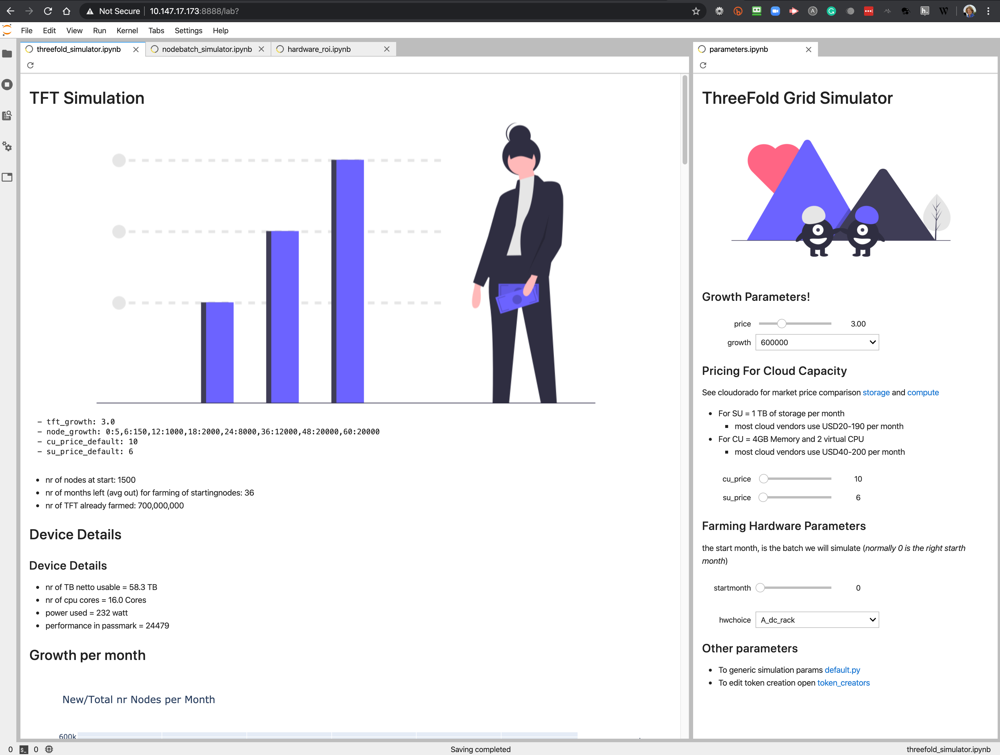

# Simulator Usage Basics




When you install the TFGrid SDK you can look for the simulator package and install it. When starting it you will get access to this python notbooke.

The simulator is a quite complicated piece of software it calculates the full behavior of the grid over 120 months depending the arguments used.

## The main parameters

### TFT price

You can set a target TFT price which is ofcourse kind of impossible to do but it allows you to simulate.

If you put it on 0, then the simulator will calculate the TFT price as follows.

```python

five_year_revenue = nrnodes * cpr * usd_price_for_1_cpr * 12 months * 5 year 
#lets put 20% discount in (because not all nodes will be full)
five_year_revenue = five_year_revenue * 0.8
TFT_price = five_year_revenue / total_amount_of_tokens_farmed 

```

- The 5 year revenue is recurring revenue.
- This is not a bad way how to establish value for a hosting business (cloud is a hosting services business)
- the tft price is that the five_year_revenue simulated / total amount of tokens


This will give us a quite good simulation of a possible TFT price.

### growth

- Chose the target amount of nodes on the grid in 5 years from now.
- 1m (1,000,000) nodes is less than 0.5% marketshare of the cloud at that point
- 2m should be realistic, but as you will see this leads to super high TFT price

### CU & SU price

- CU = compute price (4GB memory, 2 virtual CPU)
    - in market USD 20-200
    - if you want to be very aggressive put on 8
- SU = storage price for 1TB of storate per month
    - in market USD 20-220
    - if you want to be very aggressive put on 6
    - in market the prices are very non transparant

a good site to check prices on is on [cloudorado](https://www.cloudorado.com/cloud_storage_comparison.jsp)


## farming parameters

- see hardware roi part, not relevant in main section


