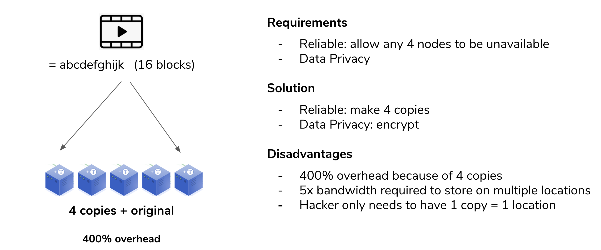
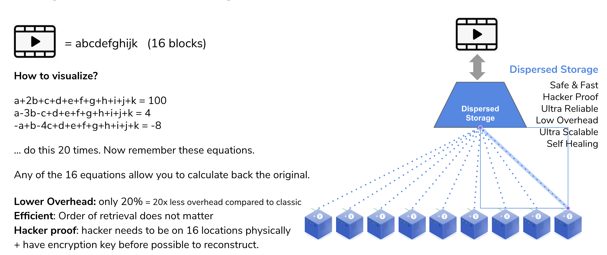

## Storage architecture

### Introduction
The storage architecture follows the true peer2peer design of this grid.  Any participating node can store elements of objects (files, photos, movies, databases etc.) by offering a slice of the present (local) storage devices. Managing storage and retrieval of all of these distributed fragments is done by software that creates delopment or enduser interfaces for this storage algorithm.  We call this dispersed storage.  More details later.

Peer2peer provides the unique proposition of selecting storage providers that match your application, service of business criteria. For example you might be looking to store data for you application in a certain geographic area (for goveernance and compliance) reasons.  Also you might want to use different "storage policies" for different types of data.  Exmaples are live versus archived data.  All  of these uses cases are possible with this storage architecture and can be build by using the same building blocks produced by farmers and consumed by developers / end users.

### Displersed storage architecture design philosophie

#### Classic storage

Classic storage designs reliability arround (multiple) copies of the same data. The reasoning is to build storage solutions around the following structure:
- The **first copy** is the active which is being worked on.  Intense storage and retrieval processes.
- Then there is a (hot) **second copy** of the data that is continuously being synchornised with the live one and is available in case the active copy fails for immediate (uninterrupted) failover
- The **third copy** is a cold, off-line copy, also referred to as a backup.  This is a complete copy of the data which is available but not (live accessible)
- The fourth copy is what is usally referenced to as "archive".  On off-site, securedly stored (physical storage) offline copy of the data that can be pulled in in case all of the above fails.

All of the above concepts were invented when datasets were small(er) and could still fit on one device, or is a single (dual redundant) box.  This is no longer the case and therefore these storage principles are outdated.

#### Dispersed storage

Today we produce more data than ever before (in the last two years we produced more data than in the history of mankind, and this is accelarating exponentialy).  We cannot continue to make full copies of data to make sure it is stored in a realiable manner.  This will simply not scale.  We need to move from securing the whoel dataset to securing all the objects that make up a dataset.

Dispersed storage is 

### Available today

## Storage details

